# Image Processing Experiments

Small Python scripts for learning and experimenting with image processing concepts.

This repository covers spatial-domain filtering, Fourier-domain filtering, edge detection, sampling, quantization, and synthetic frequency patterns.

The repository does not include an input image. To run the image-based scripts, use your own image file and pass its path as a command-line argument.

## Examples

### Fourier Spectrum

```bash
python src/fourier_spectrum.py path/to/your_image.jpg -o assets/fourier_spectrum.png
```

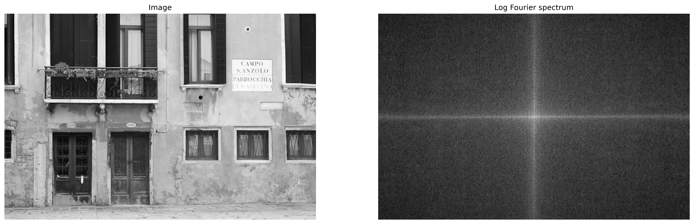

### Sobel Edge Detection

```bash
python src/sobel_filter.py path/to/your_image.jpg -o assets/sobel_filter.png
```

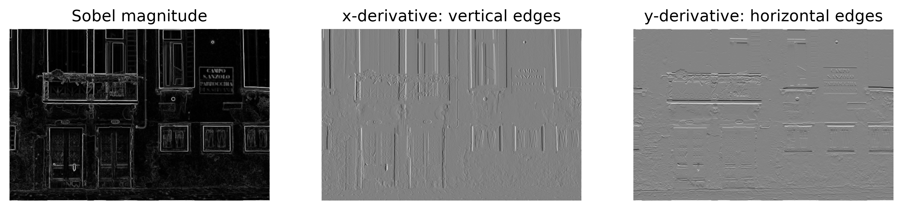

### Low-Pass and High-Pass Filtering

```bash
python src/low_pass_filter.py path/to/your_image.jpg -o assets/low_pass_filter.png
python src/high_pass_filter.py path/to/your_image.jpg -o assets/high_pass_filter.png
```

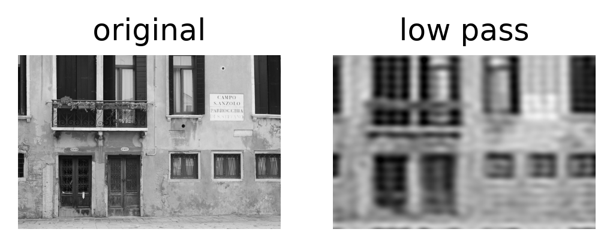

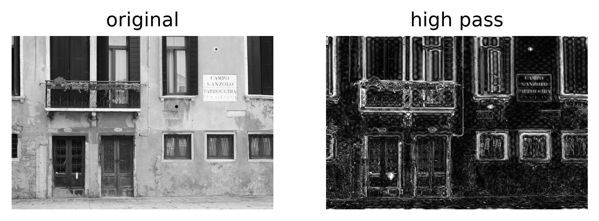

### Gaussian Filtering

```bash
python src/gaussian_filter.py path/to/your_image.jpg -o assets/gaussian_filter.png
```

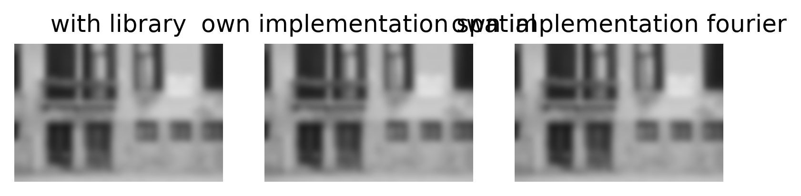

### Gaussian Low-Pass Filtering

```bash
python src/gaussian_low_pass_filter.py path/to/your_image.jpg -o assets/gaussian_low_pass_filter.png
```

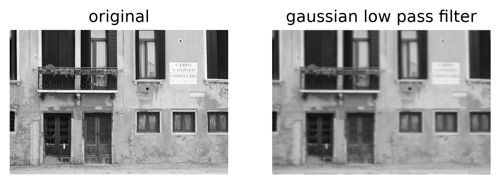

### Band-Pass and Band-Stop Filtering

```bash
python src/band_pass_filter.py path/to/your_image.jpg -o assets/band_pass.png
python src/band_stop_filter.py path/to/your_image.jpg -o assets/band_stop.png
```

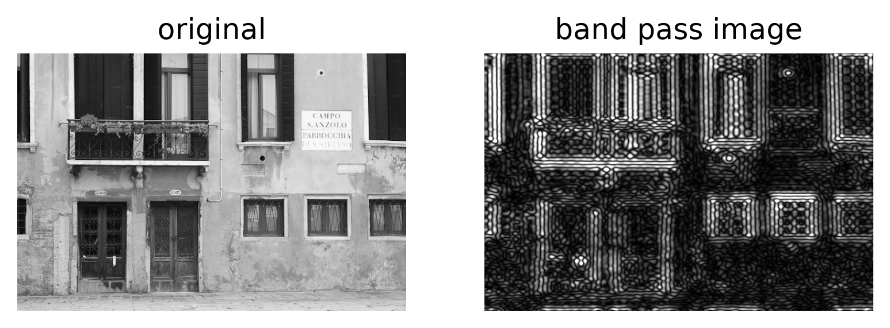

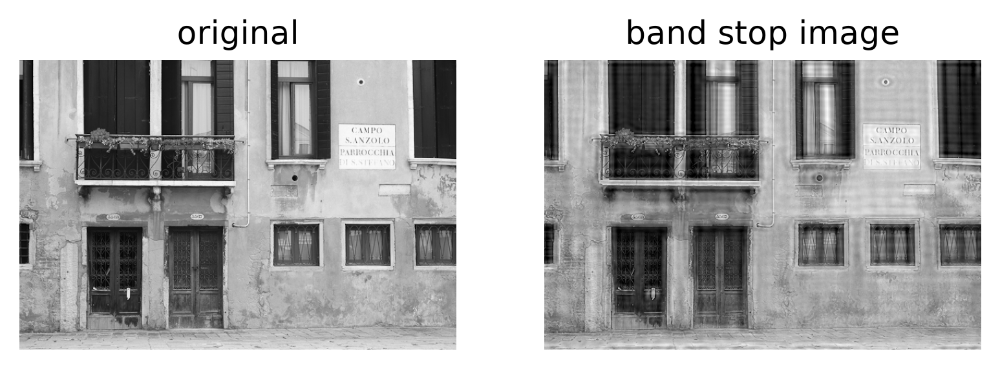

### Correlation vs Convolution

```bash
python src/corr_conv.py path/to/your_image.jpg -o assets/corr_conv.png
```

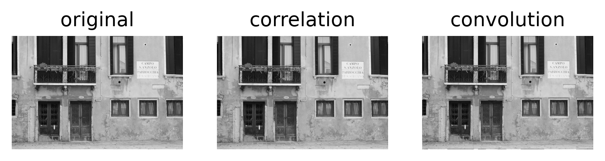

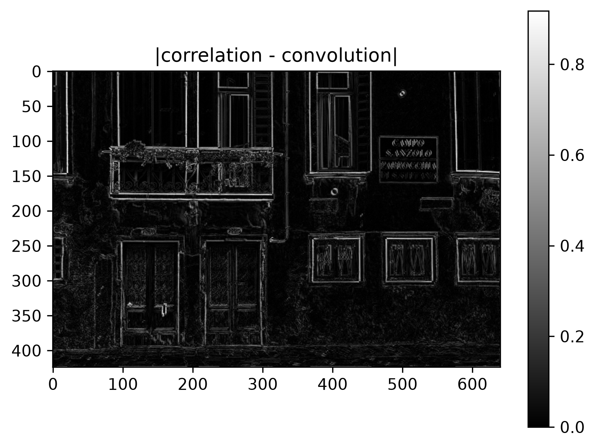

### Sampling and Quantization

```bash
python src/sampling.py path/to/your_image.jpg -o assets/sampling.png
```

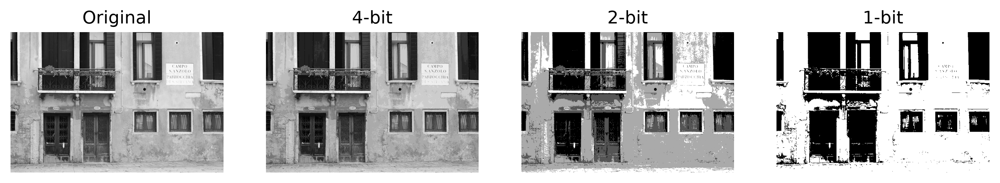

### Mean Filtering

```bash
python src/mean_filter.py path/to/your_image.jpg -o assets/mean_filter.png
```

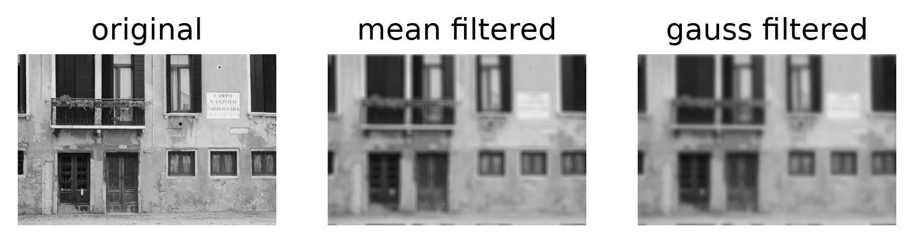

### Laplace Filtering

```bash
python src/laplace_filter.py path/to/your_image.jpg -o assets/laplace_filter.png
```

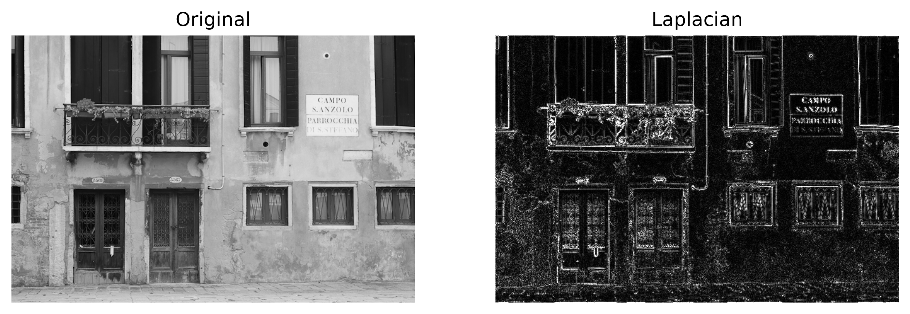

### Synthetic Cosine Patterns

```bash
python src/cos_patterns.py -o assets/cos_patterns.png
```

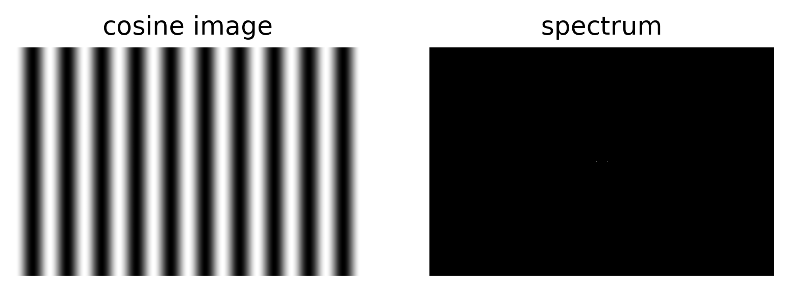

## Topics Covered

- Image loading and grayscale conversion
- Sampling and quantization basics
- Mean filtering
- Gaussian filtering
- Correlation vs convolution
- Sobel edge detection
- Laplace filtering
- Fourier spectrum visualization
- Synthetic cosine patterns
- Low-pass filtering in the Fourier domain
- High-pass filtering in the Fourier domain
- Gaussian low-pass filtering
- Band-pass filtering
- Band-stop filtering

## Requirements

The scripts use:

```text
numpy
scipy
matplotlib
```

Install the dependencies with:

```bash
pip install -r requirements.txt
```

Or, using a virtual environment:

```bash
python -m venv .venv
source .venv/bin/activate
pip install -r requirements.txt
```

## Usage

Run an image-based script by passing the image path as an argument:

```bash
python src/sobel_filter.py path/to/your_image.jpg
```

To save the output figure instead of opening a Matplotlib window, use `-o` or `--output`:

```bash
python src/sobel_filter.py path/to/your_image.jpg -o assets/sobel_filter.png
```

The script `src/cos_patterns.py` creates synthetic cosine-pattern images, so it does not need an external image file:

```bash
python src/cos_patterns.py
```

or:

```bash
python src/cos_patterns.py -o assets/cos_patterns.png
```

Each script opens a Matplotlib window if no output path is provided.

## Script Overview

### `src/sampling.py`

Demonstrates image quantization with different bit depths.

### `src/mean_filter.py`

Applies mean and Gaussian smoothing in the spatial domain.

### `src/gaussian_filter.py`

Compares Gaussian filtering using SciPy, manual spatial convolution, and Fourier-domain multiplication.

### `src/corr_conv.py`

Compares correlation and convolution using an asymmetric kernel.

### `src/sobel_filter.py`

Applies Sobel filters in x- and y-direction and computes the gradient magnitude.

### `src/laplace_filter.py`

Applies a Laplace filter for second-derivative edge detection.

### `src/fourier_spectrum.py`

Computes and visualizes the Fourier magnitude spectrum of an image.

### `src/cos_patterns.py`

Creates synthetic cosine patterns and visualizes their Fourier spectra.

### `src/low_pass_filter.py`

Applies an ideal low-pass filter in the Fourier domain.

### `src/high_pass_filter.py`

Applies an ideal high-pass filter in the Fourier domain.

### `src/gaussian_low_pass_filter.py`

Applies a Gaussian low-pass filter in the Fourier domain.

### `src/band_pass_filter.py`

Keeps only a selected frequency band in the Fourier domain.

### `src/band_stop_filter.py`

Removes a selected frequency band in the Fourier domain.

## Fourier-Domain Workflow

The Fourier-domain examples follow this general workflow:

```text
image
-> FFT
-> shift zero frequency to the center
-> create frequency mask
-> apply mask
-> inverse shift
-> inverse FFT
-> filtered image
```

In the shifted Fourier spectrum:

```text
center = low frequencies
far from center = high frequencies
```

This makes it possible to create masks such as low-pass, high-pass, band-pass, and band-stop filters.

## Visualization Notes

Some filters produce positive and negative values. For example:

- high-pass filters
- band-pass filters
- Sobel filters
- Laplace filters

For visualization, these results are sometimes displayed using absolute values.

## Code Quality

This repository uses `pre-commit` and `ruff` for basic code checks and formatting.

Run all checks manually with:

```bash
pre-commit run --all-files
```

## Image Note

No input image is included in this repository.

Use your own image for experimentation. If you publish your own image with this repository, make sure that the image license allows public sharing.

The example output images in `assets/` are generated results from running the scripts.

## Purpose

This repository is mainly for learning and experimenting with image processing concepts in Python.
